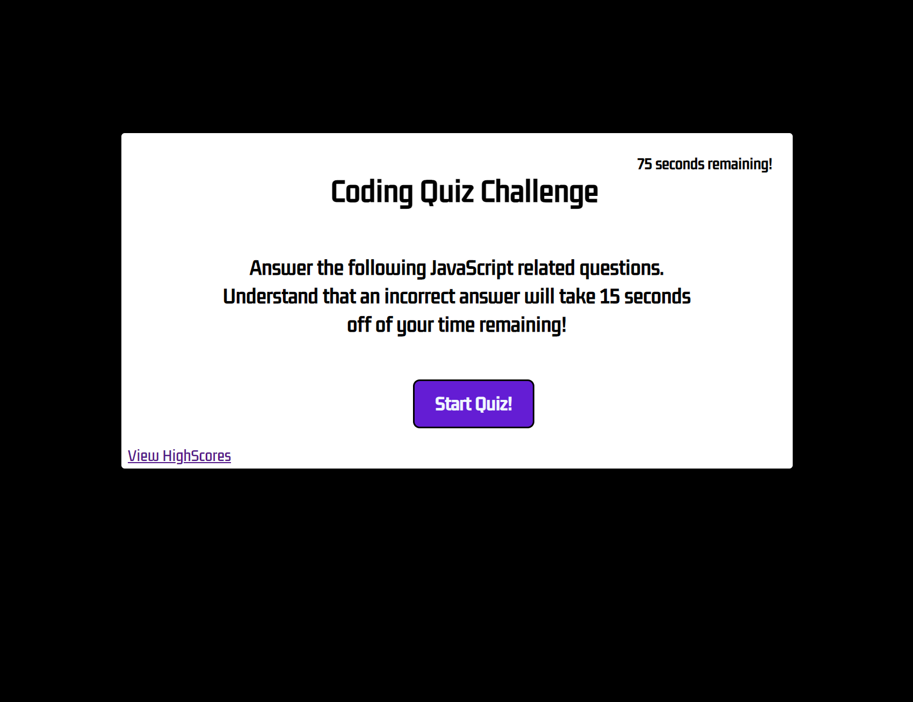
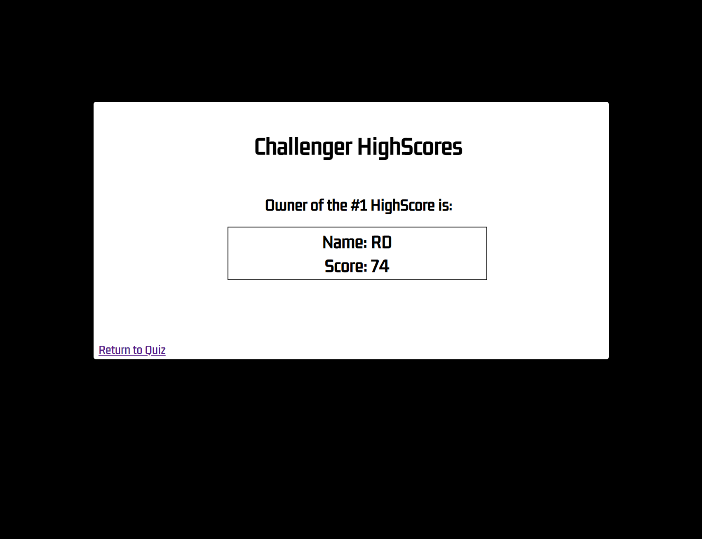

# RDJavaScriptQuiz

This program is an interactive JavaScript quiz. To answer each question, you click on the answer you wish to select, it then moves on the the next question. 
At the end of the test, it will tell you your final score and let you enter your initials. The first score will be logged. any score after that will be compared to the current highscore and if it is higher, it will overwrite it. 

Deployed Site: https://rdoolz51.github.io/RDJavaScriptQuiz/

